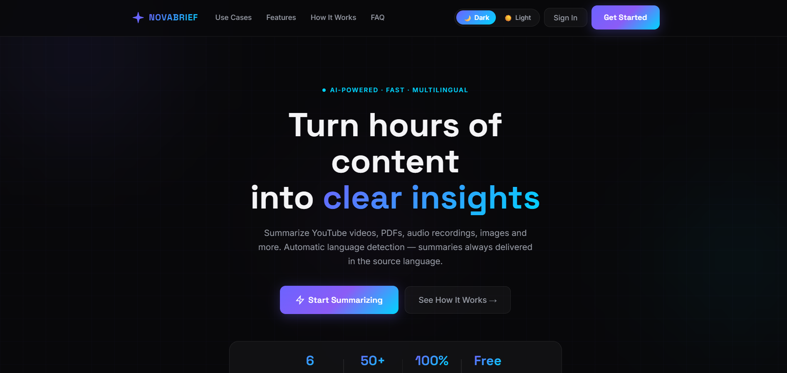
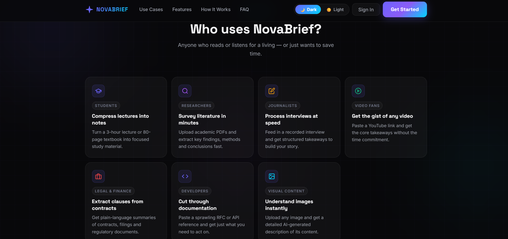
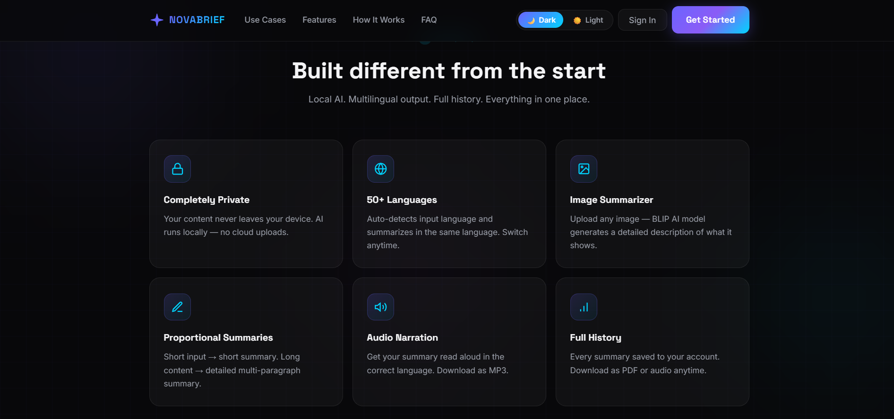
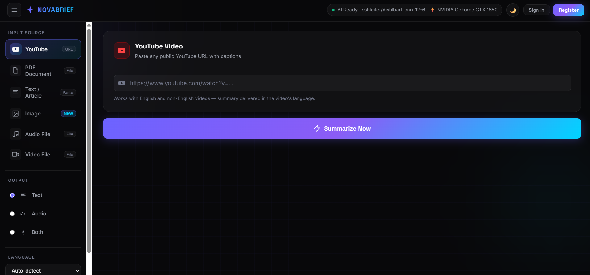

# NovaBrief

AI-powered summarizer that turns YouTube videos, PDFs, audio/video recordings, images, and raw text into clear, concise summaries — entirely with local AI models. No external AI API, no per-request cost, no data leaving your machine.

## Features

- **Multi-source input** — YouTube links, PDFs, images, audio (mp3/wav/m4a/aac/ogg/flac/wma/opus), video (mp4/mov/mkv/avi/webm/wmv/flv/m4v), and plain text
- **Local AI, not cloud APIs** — BART for text summarization, BLIP for image captioning, faster-whisper for audio/video transcription, all running on your own hardware (GPU accelerated when available, with a force-CPU option)
- **Automatic language detection** — summaries are delivered back in the source language, with on-demand translation
- **Text-to-speech** — listen to any summary
- **User accounts** — signup/login with bcrypt-hashed passwords, per-user history
- **History** — past summaries are saved and can be exported as PDF, individually or in bulk
- **Admin panel** — user overview and diagnostics for configured admin emails
- **Result caching** — re-summarizing identical content (same file bytes or YouTube video) skips straight to the saved result

## Screenshots

| | |
|---|---|
|  |  |
|  |  |

## Tech stack

Flask · MySQL · PyTorch/Transformers (BART) · faster-whisper · BLIP · vanilla JS/CSS on the frontend

## Project structure

```
novabrief-full/
├── app.py                  # Flask app — routes, AI pipeline, auth
├── config.py                # Configuration (reads from environment/.env)
├── setup_db.py               # One-time MySQL database + table setup
├── requirements.txt
├── env.example                # Copy to .env and fill in your values
├── static/
│   ├── css/                  # Stylesheets
│   └── js/                   # Frontend logic (app, history, admin, theme, TTS)
├── templates/                 # Jinja2 HTML templates
├── screenshots/                # Images used in this README
└── test_performance_logic.py
```

## Prerequisites

- Python 3.10+
- A running MySQL server
- ~2-4 GB free disk space for the AI models (downloaded automatically on first run)

ffmpeg is handled automatically via the bundled `imageio-ffmpeg` package — no separate system install needed.

## Quick start

**1. Clone and enter the project**
```bash
git clone https://github.com/<your-username>/<repo-name>.git
cd novabrief-full
```

**2. Create a virtual environment and install dependencies**
```bash
python -m venv venv
source venv/bin/activate        # Windows: venv\Scripts\activate
pip install -r requirements.txt
```

**3. Configure your environment**
```bash
cp env.example .env
```
Then edit `.env` and set your real `MYSQL_PASSWORD`, a random `SECRET_KEY` (the file tells you how to generate one), and your own `NOVABRIEF_ADMIN_EMAILS` if you want admin panel access. `.env` is already git-ignored — it will never be committed.

**4. Set up the database**
```bash
python setup_db.py
```
This creates the database and tables for you (`users`, `summaries`) — just make sure MySQL is running first and the credentials in `.env` can connect.

**5. Run the app**
```bash
python app.py
```
Open `http://localhost:5000`, sign up, and start summarizing.

## Configuration

All settings are environment variables, documented in `env.example`. The essentials:

| Variable | Purpose |
|---|---|
| `MYSQL_HOST`, `MYSQL_PORT`, `MYSQL_USER`, `MYSQL_PASSWORD`, `MYSQL_DATABASE` | Database connection |
| `SECRET_KEY` | Flask session signing key — must be random in production |
| `NOVABRIEF_ADMIN_EMAILS` | Comma-separated emails granted admin panel access |
| `NOVABRIEF_CORS_ORIGINS` | Comma-separated origins allowed to send credentials |

See `config.py` for the full list, including AI model choices, timeouts, and cache expiry — all optional with sensible defaults.

## Security note

Never commit `.env` or real credentials to this repo. `config.py` and `setup_db.py` only ever ship with the placeholder `change-me` — real values belong in your local `.env` file, which is already excluded via `.gitignore`.

## Contributing

Issues and pull requests are welcome. For anything non-trivial, please open an issue first to discuss what you'd like to change.

## License

No license has been specified yet. If you want others to know how they're allowed to use this code, consider adding one (MIT and Apache 2.0 are common, permissive choices) — [choosealicense.com](https://choosealicense.com/) can help you pick.
